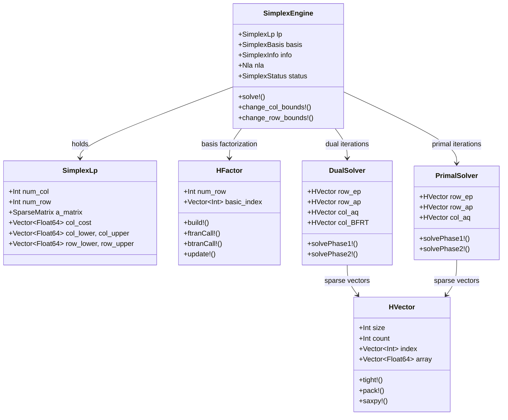
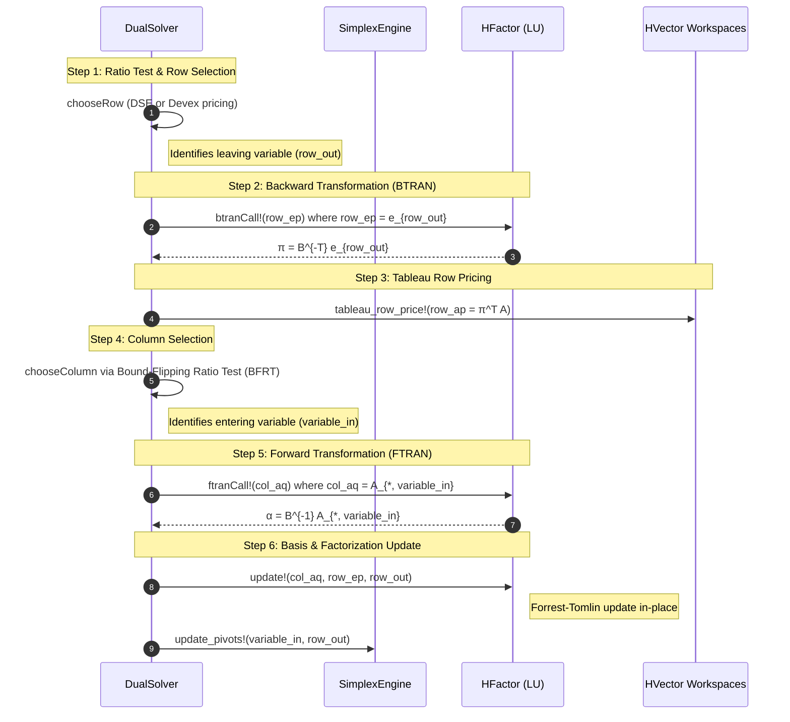

# System Architecture

TinyHiGHS is organized into modular layers designed for maximal memory efficiency, cache locality, and numerical stability.

---

## High-Level Architecture Diagram

The diagram below illustrates how data and control flow through TinyHiGHS:

---

## Revised Simplex Iteration Lifecycle

In the dual simplex method (default), each iteration performs a pivot to drive primal infeasibilities to zero while maintaining dual feasibility.

---

## Core Components

### 1. `SimplexEngine`
The central state container. It owns the problem specification, basis history, control flags, and preallocated working memory. All algorithmic actions (dual iterations, primal iterations, scaling, perturbation, bound modifications) operate on this engine.

### 2. `HVector` (Sparse/Dense Workspaces)
HiGHS and TinyHiGHS rely on a hybrid sparse/dense vector structure:
- A dense array of length $m$ provides $O(1)$ lookup.
- A non-zero index list `index[1:count]` enables $O(\text{nnz})$ sparse traversal and hyper-sparse graph walks.
- When fill-in exceeds ~30%, routines automatically switch to dense SIMD loops to maximize hardware memory bandwidth.

### 3. `HFactor` (LU Basis Factorization)
Maintains the factorization $P B Q = L U$:
- **Initial Factorization (`build!`)**: Uses Markowitz threshold pivoting to minimize fill-in.
- **Basis Updates (`update!`)**: Applies Forrest-Tomlin updates to maintain $L$ and $U$ without full refactorization.
- **Unit Pivot Bypass**: Directly executes $x / (\pm 1.0)$ as identity or negation, avoiding hardware `FDIV` stalls.

### 4. `DualSolver` & `PrimalSolver`
- **Dual Steepest Edge (DSE)**: Provides steep progress directions with adaptive switching to Devex if weight computation becomes expensive.
- **Bound-Flipping Ratio Test (BFRT)**: Allows passing multiple non-basic bounds in a single iteration, dramatically cutting down iteration counts on box-constrained models.
- **Cycling Mitigation**: 64-bit basis hash tracking and taboo lists prevent degeneracy loops.
