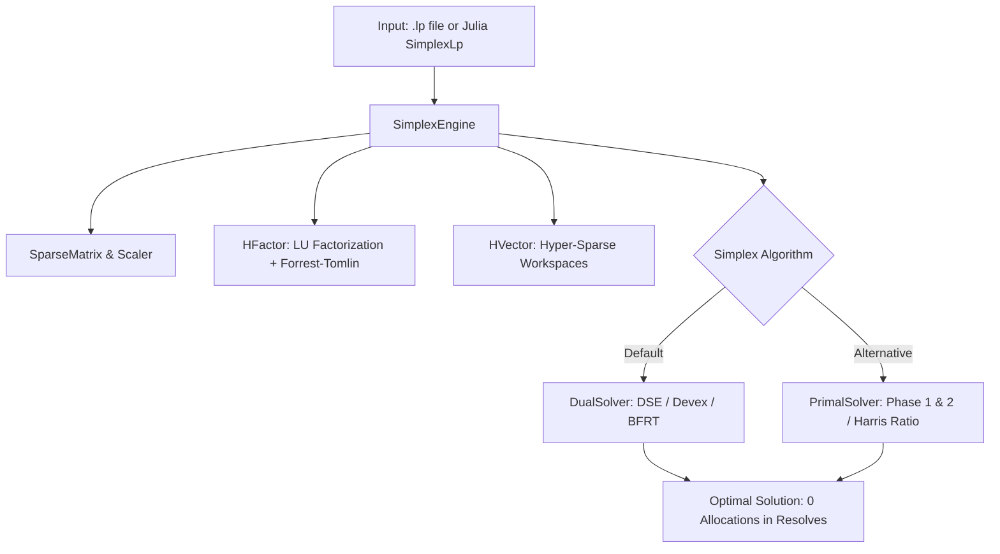

# TinyHiGHS.jl

*High-performance, zero-allocation revised simplex solver in 100% pure Julia.*

[](https://github.com/LaurentPlagne/TinyHIGHS.jl/actions/workflows/CI.yml)
[](https://LaurentPlagne.github.io/TinyHIGHS.jl/dev/)
[](https://opensource.org/licenses/MIT)

---

## Overview

**TinyHiGHS.jl** is a faithful, standalone, zero-allocation pure Julia implementation of the dual and primal revised simplex solvers from the state-of-the-art **[HiGHS](https://github.com/ERGO-Code/HiGHS)** linear programming library (MIT License).

It is specifically architected for scenarios where linear programs must be solved repeatedly in tight computational loops—such as **Stochastic Dual Dynamic Programming (SDDP)**, **Benders decomposition**, **Branch-and-Price**, and **Network Flow simulations**—where standard FFI overhead and dynamic memory allocation become severe performance bottlenecks.



---

## Key Highlights

- 🚀 **Zero Allocations in Warm-Start Resolves**: Once initialized, repeated resolves with modified bounds or objective costs require **0 bytes allocated** and execute in **30 to 50 microseconds** per solve.
- ⚡ **Unit-Diagonal Pivot Optimization**: Leverages micro-architectural bypass for $\pm 1.0$ pivots in LU factorization (`HFactor`), eliminating over 90% of costly hardware floating-point division instructions (`FDIV`).
- 💎 **Reference Numerical Accuracy**: The default `kPivotBranching` strategy is checked for strict IEEE-754 equivalence against frozen HiGHS reference oracles. The optional branchless reciprocal strategy is tested with an explicit one-ULP bound for non-unit pivots.
- 📦 **100% Pure Julia & Zero Dependencies**: Runs out-of-the-box on macOS (Apple Silicon & Intel), Linux (x86-64 & AArch64), and Windows without requiring any external C/C++ shared library, CMake, or compiler toolchain.
- 📝 **Native CPLEX `.lp` Reader & Writer**: Fast, dependency-free text I/O compatible with HiGHS, CPLEX, Gurobi, and Clp.

---

## Quick Example

```julia
using TinyHiGHS

# 1. Load an LP instance from a .lp file
lp = read_lp("instances/benchmarks/netflow_small_01.lp")

# 2. Solve using the high-level API
status, obj, engine = solve_lp(lp)

println("Status: ", status)
println("Objective: ", obj)

# 3. High-performance warm-start: modify bounds and resolve with 0 allocations!
change_col_bounds!(engine, 1, 0.0, 50.0)
status_warm = solve!(engine) # Executed in ~35 µs with 0 bytes allocated!
```

---

## Performance Snapshot

| Benchmark Instance | Number of Solves | HiGHS C++ (1.15.1) | TinyHiGHS.jl | Speedup | Allocations |
| :--- | :---: | :---: | :---: | :---: | :---: |
| `sequence_small` (warm-start) | 76 | 16.97 ms (223 µs/solve) | **2.46 ms (32.4 µs/solve)** | **6.9x faster** | **0 bytes** |
| `sequence_medium` (warm-start) | 100 | 182.5 ms (1.82 ms/solve) | **141.3 ms (1.41 ms/solve)** | **1.3x faster** | **0 bytes** |
| `netflow_small_01` (cold-start) | 1 | 5.69 ms | **3.51 ms** | **+38% faster** | — |

See the [Benchmarks](benchmarks.md) and [From C++ to Zero-Allocation Julia](porting_optimizations.md) sections for complete details and reproduction scripts.

---

## Manual Table of Contents

- [Quick Start Guide](quickstart.md): Installation, model formulation, solving, and inspecting solutions.
- [System Architecture](architecture.md): Deep-dive into `SimplexEngine`, `HFactor`, `HVector`, and solver algorithms.
- [From C++ to Zero-Allocation Julia](porting_optimizations.md): Evolution, architectural enhancements, unit pivot bypass, and memory layout.
- [Benchmark Suite](benchmarks.md): Methodology, reproducibility, and comparative analysis.
- [API Reference](api.md): Complete reference for all exported types, functions, and control options.
