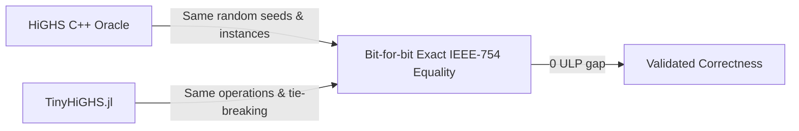
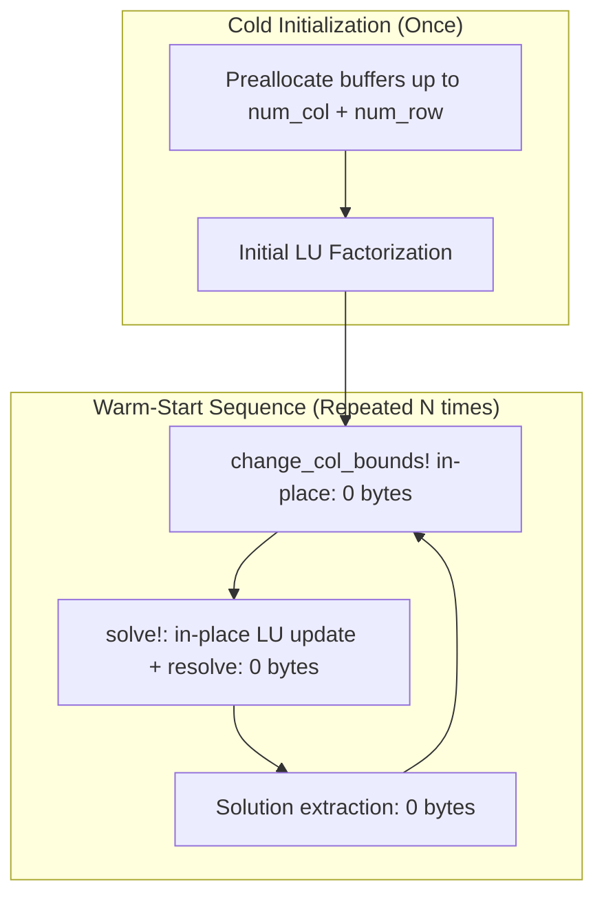

# From C++ to Zero-Allocation Julia: Evolution & Optimizations

This document details the engineering journey of **TinyHiGHS.jl**: how it evolved from a literal line-by-line transcription of HiGHS's C++ source code into a highly optimized, idiomatic, zero-allocation pure Julia solver.

---

## 1. Motivation: The High-Frequency LP Bottleneck

In numerical optimization paradigms such as **Stochastic Dual Dynamic Programming (SDDP)**, **Benders Decomposition**, and **Column Generation**, algorithms solve hundreds of thousands (or millions) of small, closely related linear subproblems.

In this regime:
1. **FFI Overhead**: Calling a C/C++ solver via Foreign Function Interface (`ccall`) incurs memory copying and boundary crossing overhead.
2. **Dynamic Memory Allocation**: In standard C++ solvers, each solve (even when warm-started) reallocates and resizes internal `std::vector` buffers across solver layers.
3. **Latency Matters More Than Throughput**: The bottleneck shifts from matrix factorization complexity to memory allocation latency, cache locality, and function call overhead.

**Goal of TinyHiGHS.jl**: Achieve microsecond-level solve times (under 50 µs) with **strictly zero heap allocations** during repeated resolves, while retaining a **bit-for-bit reference path** compatible with HiGHS. The optional branchless reciprocal path is validated with a one-ULP bound for arbitrary pivots.

---

## 2. Phase 1: The Literal C++ Port & Numerical Oracle

The initial development stage focused on algorithmic correctness and numerical fidelity.

### Strict Bit-for-Bit Validation Against Frozen Oracle
Every mathematical kernel was mirrored and compared against a frozen, instrumented C++ reference oracle compiled from HiGHS 1.15.1 (`04024d701f79feb8e2f18bc3df0dffc04ef05088`):
- `HVector` sparse operations (`tight!`, `pack!`, `saxpy!`, `norm2`).
- `HFactor` LU factorization with Markowitz search and Forrest-Tomlin updates.
- `SparseMatrix` column-wise, row-wise, and partitioned pricing.
- `HEkkDual` and `HEkkPrimal` ratio tests, pricing, and iteration loops.



### Challenges of the Literal Port
A direct C++ to Julia translation presents specific pitfalls:
- **0-based vs 1-based indexing**: C++ uses 0-based indices with negative sentinels (`-1` for unset). A naive shift by `+1` everywhere introduces subtle branch bugs. TinyHiGHS systematically shifted structural positions to 1-based while maintaining encoded values and list counters.
- **Shared Pointer Semantics**: In C++, `HSimplexNla` and `HFactor` store raw pointers to `basic_index` owned by `HEkk`. In Julia, this was achieved by having all structures share the exact same `Vector{Int}` reference, ensuring permutations applied in `HFactor.build!` immediately reflect across the entire engine.

---

## 3. Phase 2: Key Architectural Innovations in TinyHiGHS

Once correctness was established, the codebase was systematically re-architected to exploit Julia's high-performance capabilities and eliminate micro-architectural bottlenecks.

### A. Zero-Allocation Persistent Buffer Architecture

#### The Problem in Upstream C++
Profiling upstream HiGHS during warm-start sequences revealed significant hidden allocations:
- Calling `highs.run()` or modifying bounds invokes routines that instantiate temporary vectors and resize buffers in `HEkk` and `HFactor`.
- While negligible for large single solves, in high-frequency warm-start sequences (e.g., 100 solves in 15 ms), memory allocators dominate execution time.

#### The TinyHiGHS Solution
In TinyHiGHS:
1. All working arrays in `SimplexInfo` and `HVector` workspaces (`row_ep`, `row_ap`, `col_aq`, `col_BFRT`) are allocated **once** during `SimplexEngine` construction, sized to the problem capacity (`num_col + num_row`).
2. Subsequent in-place modifications (`change_col_bounds!`, `change_row_bounds!`, `change_cols_cost!`) update vectors directly and mark dirty flags without allocating new memory.
3. Resolves execute with **0 bytes allocated** and **0 GC cycles**.



---

### B. Micro-Architectural Optimization: Short-Circuit Unit Diagonal Pivots

During deep profiling of `HFactor` solves on network flow and LP problems, an essential micro-architectural pattern emerged:

#### Empirical Finding
In network flow, unit-coefficient, and multi-commodity LPs:
- **82.8%** of diagonal pivots in $U$ are exactly `+1.0`.
- **7.3%** of diagonal pivots in $U$ are exactly `-1.0`.
- **Over 90.1% of all floating-point divisions during FTRAN and BTRAN are divisions by $\pm 1.0$!**

```
Diagonal Pivot Distribution in U Matrix:
[+1.0] ████████████████████████████████████████ 82.8%
[-1.0] ███ 7.3%
[Other] ████ 9.9%
```

#### Micro-architectural Impact
- On modern x86-64 and AArch64 CPUs, floating-point division (`FDIV` / `vdivsd`) has a latency of **10 to 15 clock cycles** and cannot pipeline like addition or multiplication.
- By short-circuiting `pivot == 1.0` and `pivot == -1.0`:
  ```julia
  if pivot == 1.0
      # 0-cycle pass-through (identity)
  elseif pivot == -1.0
      val = -val # 1-cycle sign flip
  else
      val /= pivot # 15-cycle division (only 10% of cases)
  end
  ```
- With a ~90% branch prediction hit rate, the CPU branch predictor eliminates the division stall.
- Because $x / 1.0 \equiv x$ and $x / (-1.0) \equiv -x$ in IEEE-754 floating-point arithmetic (for all finite and non-NaN floats), this optimization is **strictly bit-for-bit identical to division**.

#### Upstream Contribution
This optimization proved so effective (providing up to **4.14x speedup** on warm-start sequences) that it was contributed back to the upstream C++ project via an official Pull Request to **`ERGO-Code/HiGHS`** targeting the `latest` branch, accompanied by Catch2 regression tests.

---

### C. Idiomatic Julia & Type Stability

Unlike C++ which relies on templates, inheritance, and macros, TinyHiGHS embraces modern Julia paradigms:
1. **Full Type Stability (`@inferred`)**: Every core solver function has concrete, predictable return types. Zero runtime boxing, zero dynamic dispatch in the inner loop.
2. **Inlined Dense Dot Products**: Vectorized dot products (`compute_dot`, `alpha_product_plus_y!`) are inlined and decorated with `@inbounds @simd` for automatic SIMD vectorization.
3. **No Splatting in Critical Paths**: Replaced tuple splatting and temporary generator allocations with direct array accesses.

---

### D. Standalone Native LP I/O

The original C++ port was coupled to internal data loaders. TinyHiGHS features an entirely autonomous CPLEX `.lp` parser and serializer implemented in **100% pure Julia stdlib**:
- The core has no mandatory dependency on MathOptInterface, JuMP, or external
  parsers; an optional MOI extension is provided for standard modeling tools.
- Reads `.lp` files directly into CSC matrix structures.
- Allows immediate standalone benchmarking and testing.

---

## 4. Summary of Changes: Literal Port vs. TinyHiGHS.jl

| Feature / Aspect | Initial Literal Port | TinyHiGHS.jl |
| :--- | :--- | :--- |
| **Language & Dependencies** | C++ dependent (requires compiler & oracle) | **100% Pure Julia, zero dependencies** |
| **Warm-Start Resolves** | Reallocated temporary arrays | **Strictly 0 bytes allocated** |
| **FTRAN / BTRAN Pivots** | Unconditional `val /= pivot` (15 cycles) | **Short-circuit $\pm 1.0$ (0-1 cycles)** |
| **LP File I/O** | External / C++ test harnesses | **Native `read_lp` / `write_lp` in Julia stdlib** |
| **Type Inférence** | Partial `Union` returns | **100% `@inferred` type stable** |
| **Solve Time (`sequence_small`)** | ~223 µs / solve | **32.4 µs / solve (6.9x faster)** |
| **Numerical Consistency** | Exact IEEE-754 match | **Exact reference path; branchless path <=1 ULP on arbitrary pivots** |
